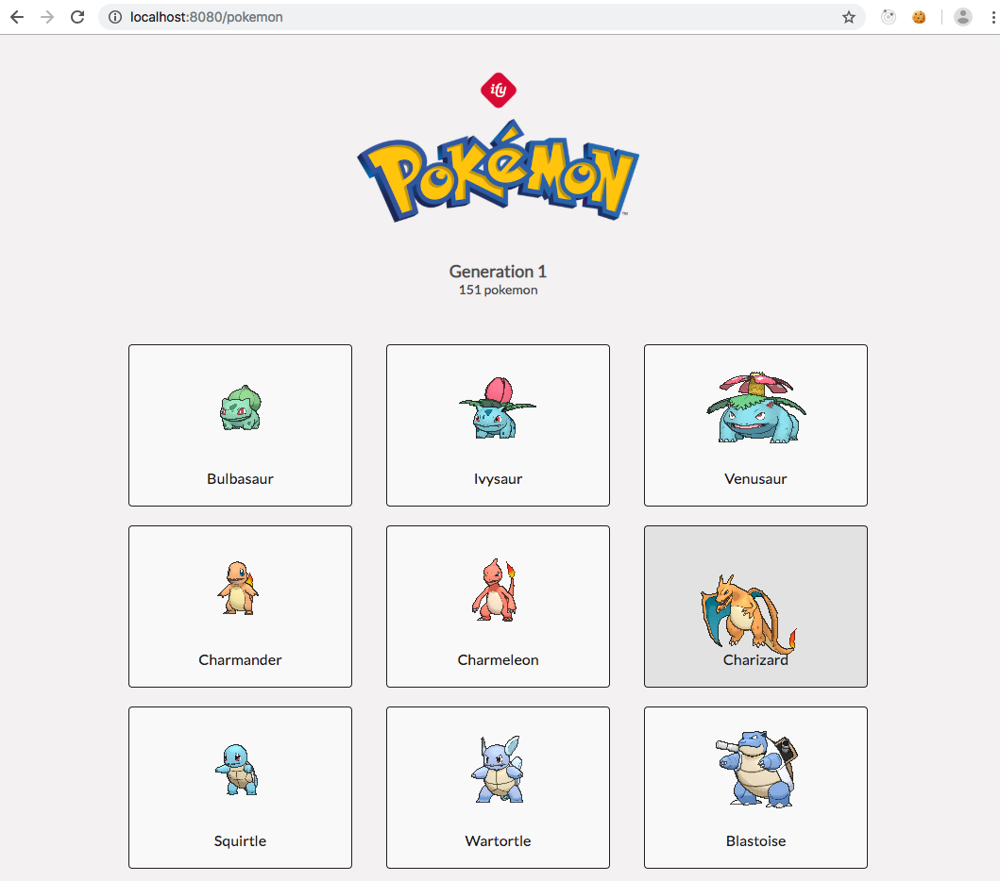

# Aplicação-React-teste

Esse é um pequeno teste para ver o nível de interação com ecossistema React, deverá ser criado uma pequena aplicação onde irá listar alguns Pokémons da API passada.

## Eventos que devem ser feitos na aplicação

1. Carregar cards exibindo os Pokémons do tipo planta, água e fogo

2. Ao clicar no card, ele deve redirecionar para uma outra página onde irá conter as irformações gerais desse Pokémon.

## Tecnologias usadas:

- NextJS (Next é um framework do react, não confudir com o Nest)
- Styled Components

## Tela para desenvolver o layout principal

